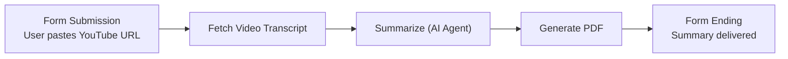

#  YouTube Video Summarizer Workflow

> An n8n automation that turns any YouTube video into a clean, easy-to-read summary — no need to watch the full video.

##  Overview

Paste a YouTube video link into a simple form, and this workflow will automatically:

1. Fetch the video's transcript
2. Summarize it using AI
3. Turn the summary into a downloadable PDF

Built entirely with **n8n** — a no-code / low-code automation tool.

##  How It Works (Pipeline)



| Step | Node | What it does |
|------|------|---------------|
| 1 | **On Form Submission** | User submits a YouTube video URL through a simple web form |
| 2 | **Fetch Video Transcript** | Calls a transcript API to pull the full transcript of the video |
| 3 | **Summarize (AI Agent)** | An AI model reads the transcript and writes a structured summary — Executive Summary, Core Strategies & Plans, Implementation Steps, and Key Takeaways |
| 4 | **Generate PDF** | Converts the AI summary text into a downloadable PDF file |
| 5 | **Form** | Returns the finished summary/PDF back to the user |

## Workflow Preview

[workflow](assets/Github1.JPG)

### Input Form


### Example Output


##  Tech Stack

- **n8n** – workflow automation engine
- **Transcript API** – fetches YouTube video transcripts
- **AI Model** – summarizes the transcript text
- **PDF Generator node** – creates the final PDF

##  Setup & Usage

1. Import the workflow JSON into your own n8n instance
2. Add your Transcript API key in the **Fetch Video Transcript** node
3. Connect your AI model credentials in the **Summarize** node
4. Activate the workflow
5. Open the form link and paste any YouTube video URL
6. Get your AI-generated summary as a PDF

##  Future Improvements

- [ ] Support videos in multiple languages
- [ ] Deliver the summary via Telegram or Email
- [ ] Support other video platforms besides YouTube

##  Project Structure

```
├── README.md
└── assets/
    ├── workflow-canvas.jpg
    ├── input-form.jpg
    └── output-summary.jpg
```

---
Built with ❤️ using n8n automation.
